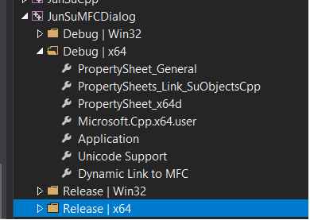
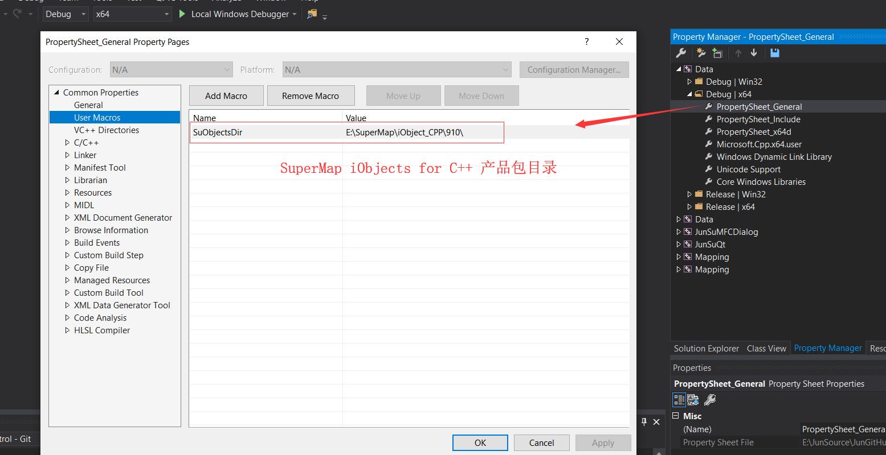
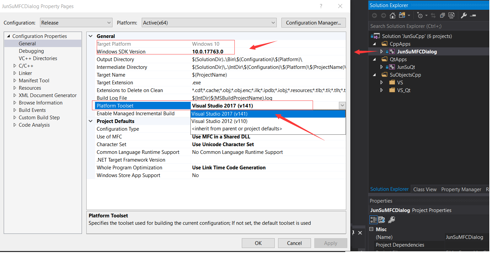
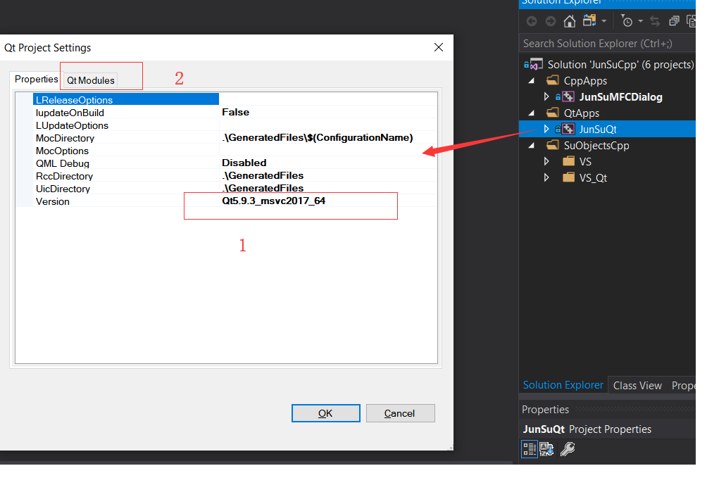
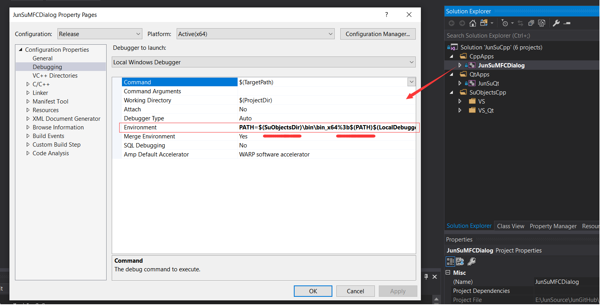
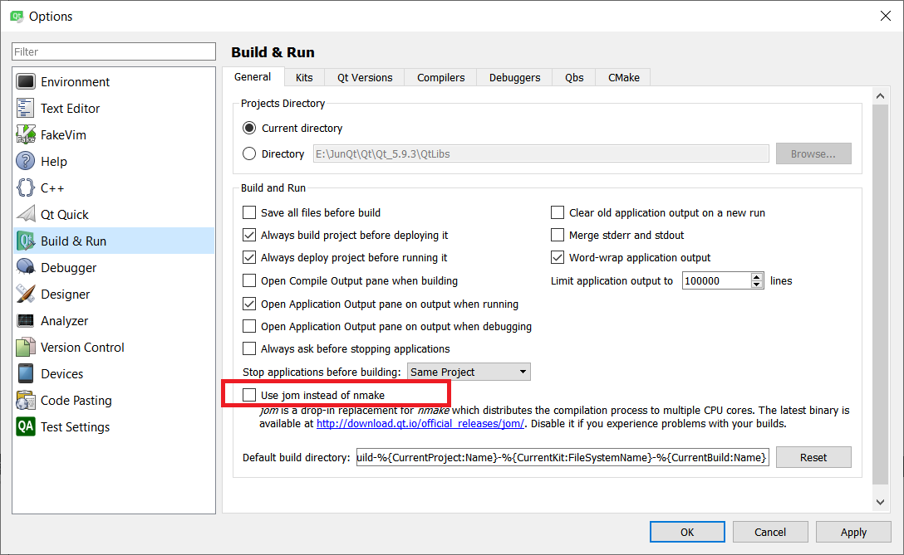
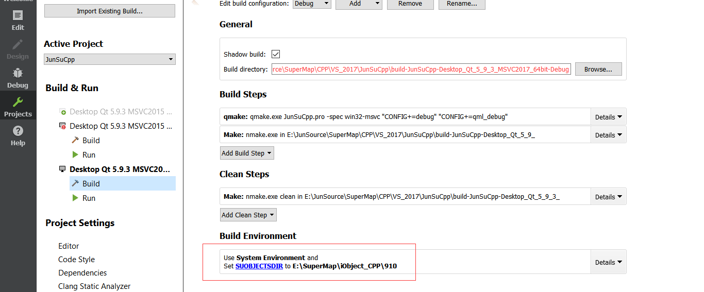
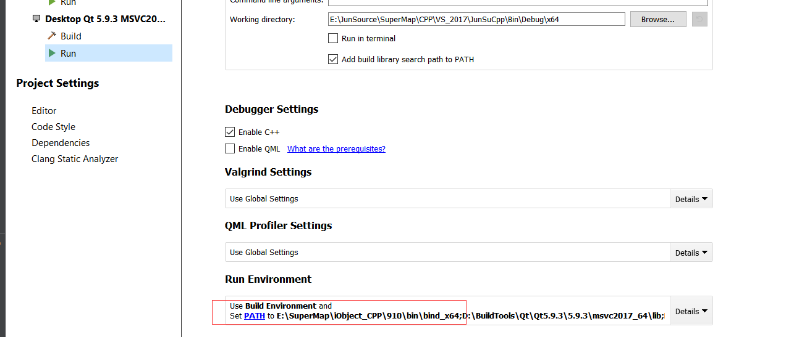

# JunSuCpp

### Description
 这个项目展示了如何使用SuperMap iObjects for C++ 进行二次开发
 
## 主要功能
1. 实现地图窗口，实现地图交互操作
2. 打开工作空间，显示地图
3. 绘制点、线、面、态势标绘对象
4. 获得选中对象
5. 动态层示例：选中对象时，在点击位置添加一条线到动态层显示
6. 态势标绘代码示例：选中对象时，在点击位置添加一个态势标绘对象到CAD数据集
7. 态势推演示例：选中点类型的标绘对象，创建比例动画

## 目录组织结构
``` lua
JunSuCpp
   |—— PropertySheets   -- MFC 项目属性配置文件
   |—— Qt_pros          -- Qt 项目配置文件,Qt Creator 打开该目录下的.pro文件即可
   |—— SuObjectsCpp     -- 部分封装SuperMap Objects C++常用功能方法的C++库,尤其是Mapping/MapControl是一个具有通用性的实现地图窗口的类
   |—— TestData         -- 测试数据
   |—— VSApps           -- 使用SuObjectsCpp中的库和SuperMap原有库构建的应用，分MFC和Qt框架两类应用
   |—— VSSolution_2017  -- VS2017解决方案文件，VS2017为当前项目使用的版本
   |—— What's New.md    -- 项目功能更新记录
```

## 开发注意事项
0. 验证过的开发工具及版本
- VS2012 + Qt5.2(Qt addin 1.2.5)
- VS2017 + Qt5.2 及以上（Qt addin 2.3.2, 使用过的Qt有Qt5.2、Qt5.6.3、Qt5.9.3、Qt5.12
- Windows, Qt Creator 5.2及以上
- Unbuntu, Qt Creator 5.2, 由于Qt库兼容问题，不支持过高版本

1. PropertySheets中添加顺序，以Debug_x64为例
``` lua
   本项目都使用这些配置文件来配置：
   1) PropertySheet_x64d.props     -- 设置SuperMap Objects C++链接库目录和链接库名称
   2) PropertySheets_Link_SuObjectsCpp.props -- 引入SuObjectsCpp中封装的库
   3) PropertySheet_General.props  -- 定义宏名"SuObjectsDir"指向SuperMap Objects C++ 产品包目录，并配置同文件目录; 头文件包括include,include/private 两个目录
   如图：
```


2. VS开发，以VS2017为例，说明打开解决方案后，需要修改的配置
- 打开属性管理器，在任意一个项目配置中打开"PropertySheet_General.props"配置文件，修改“自定义宏” -> "SuObjectsDir"指定的SuperMap iObjects for C++产品包目录。
如图：


- 打开工程属性，配置编译工具版本，如图：


- Qt工程，右键工程 -> Qt工程设置，检查设置Qt版本以及使用的模块，本项目只使用Core, GUI, Widgets, 如图:
  

- 运行库配置，该项目中直接在工程属性中进行配置，可不依赖系统环境Path, 如图配置应用工程:
  

- 若使用VS2012打开解决方案，其配置方法类似

3. Qt Creator开发，以Qt 5.9.3为例，说明配置方法
- 使用nmake编译，工具 -> 选项 -> 编译&运行 -> 常规设置 -> 不勾选 “使用jom 代替nmake”, 如图:
  

- 项目属性，编译环境配置SuObjectsDir变量，设置SuperMap iObjects for C+产品目录，如图：
  

- 项目属性，运行环境中，将SuperMap iObjects for C++ 运行库目录添加到Path, 如图：
  
